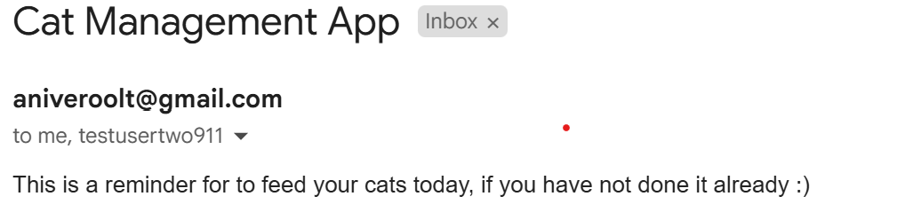

# NestJS Cats Management Proof of Concept app
### This application is a proof of concept app that uses NestJS framework to build a REST API that provides CRUD Controllers for two entities: users and cats.
### A sqlite3 database along with TypeORM are integrated to persist data long term.
### The app provides the following features:
- authentication (using json web tokens JWT)
- CRUD operations for the two entities (users, cats)
- sends email reminders every day at 10 AM so that users don't forget to feed their cats 
### What is NestJS?
NestJS is a framework used for building efficient and scalable server-side applications in Node.js. Architecturally, it is inspired from Angular by using modules to group related controllers, providers (services), and imports. The architecture is also layered, providing controllers (routes) which communicate to service layers for business logic and then finally the data acess layer (to access persistent storage). At its core, the Inversion of Control (IoC) principle allows for the framework to take care of injecting and instantiating dependencies inside our classes so we don't have to do it manually. This approach enables building applications in a modular and loosely coupled design. IoC is achieved in NestJS by using Dependency Injection (DI) thorough the `@Injectable()` decorator. This marks the class as a provider so that they can be injected into other classes via constructor parameter injection:
```
// mark service class as injectable (provider)
@Injectable()
export class CatsService {}

// constructor DI
constructor(private readonly catsService: CatsService) {}
```
### How does NestJS work?
NestJS uses three main concepts in its architecture: modules, services and controllers. 
- Modules are classes annotated with `@Module()` decorator which help Nest organize the app structure but also group related functionality. This decorator accepts an object with properties that describe it:
  - providers: a list of services and other injectable classes that will be instantiated by the NestJS dependency injection container and available within the module
  - controllers: the controllers responsible for handling incoming HTTP requests and returning responses
  - imports: other modules whose exported providers are required by this module. This allows shared functionality between modules
  - exports: a list ist of providers that should be made available to other modules that import this module
- Controllers are the classes responsible for handling incoming requests using a routing mechanism. For instance `@Controller('users')` specifices that this controller class will handle incoming requests on the /users route. They are also treated as `@Injectable()` classes behind the scenes.
- Providers are Nest classes which can be injected as dependencies. An example of this is the constructor inside the UserService:
 ```  
  constructor(
    @InjectRepository(User) private userRepository: Repository<User>
  ){}
```
This constructor tells NestJS, which uses the Dependency Injection design pattern, to instantiate the useRepository as a provider inside the service. Controllers and Providers are scoped by the module they are declared in. Modules and their classes (Controllers and Providers) form a graph that determines how Nest performs Dependency Injection (DI).
An example of an entire module is this:
```
@Module({
  imports: [TypeOrmModule.forFeature([User])],
  controllers: [UsersController],
  providers: [UsersService],
  exports: [UsersService]
})
export class UsersModule {}
```
In here, we know that NestJS will have to inject the TypeORM module at runtime because it is used as dependency inside the service, specified in the constructor`constructor(@InjectRepository(User) private userRepository: Repository<User>){}`. Also, the UsersController class will be also instantiated as this module's controller to handle the HTTP requests and it provides the UsersService so that NestJS knows it will be used inside this module. Finally, UsersSerice is also exported because it will be shared with the CatsModule in `imports: [ UsersModule],` and the MailerModule. 
It is important to know that modules in NestJS are singletons by default, so the same UsersService instance will be shared across both catsModule and MailerModule. 
### Features
1. Authentication
- Defined in the auth module, where AuthService deals with the business logic and AuthController exposes the /login and /register endpoints. For authentication, the Passport library (@nestjs/passport) is used which abstracts the logic needed for veryfing the user's credentials using the local-startegy; additionally, we have also extended the authentication logic to include JWT, also done by the jwt-strategy.
- to protect our controller endpoints, we have used Guards. Guards have a single responsibility, checking whether a given request will be handled by the route handler or not, depending on certain conditions (JWT in our case). Guards invoke strategies which are responsible with extracting credentials, calling the validate() method  in case the verification of credentials is successful or throw unauthorized exceptions otherwise
- it is also important to know that whatever validate() returns will be injected into the @Request request.user in our route handlers   
- users authenticate in the app using an email and a passport; we are using the local-strategy in passport to verify the user's credentials by defining a validateUser method inside the AuthService class:
```
@Injectable()
export class AuthService {
    constructor(
        private readonly usersService: UsersService,
        private readonly jwtService: JwtService
    ){}

    async validateUser(email: string, password: string): Promise<any> {
        const user = await this.usersService.findByEmail(email);

        if (user && user.password === password) {
          const { password, ...result } = user;
          return result;
        }
        return null;
    }


    async login(user: any) {
        const payload = { email: user.email, sub: user.id };
        return {
          access_token: this.jwtService.sign(payload),
        };
      }
}

```
- notice here that AuthService uses UsersService (so that the password credential can be checked in our validation function); the AuthModule has to import UsersModule to be able to use UsersService
```
auth.module.ts 

Module({
    imports: [
        UsersModule, 
        PassportModule,
        JwtModule.register({
            secret: jwtConstants.secret,
            signOptions: { expiresIn: '60s' },
          }),
    ],
    controllers: [AuthController],
    providers: [AuthService, LocalStrategy, JwtStrategy]
})
export class AuthModule {}
```
- and UsersService to be exported in UsersModule so that it can be accessed from other modules
```
users.module.ts
@Module({
  imports: [TypeOrmModule.forFeature([User])],
  controllers: [UsersController],
  providers: [UsersService],
  exports: [UsersService]
})
export class UsersModule {}
```
- the validateUser function is called from a custom LocalStrategy passport strategy; each strategy needs a set of options and a validate() function that calls the validateUser method
```
local.strategy.ts
@Injectable()
export class LocalStrategy extends PassportStrategy(Strategy) {
  constructor(private authService: AuthService) {
    super({usernameField: 'email'});
  }

  async validate(username: string, password: string): Promise<any> {
    const user = await this.authService.validateUser(username, password);
    if (!user) {
      throw new UnauthorizedException();
    }
    return user;
  }
}
```
- in our /login route, we use the LocalAuthGuard which invokes the local-startegy to verify the credentials (email and password); the validate() method returns the found user in case of success, which is then used inside the login() function from the @Request request.user where it is injected. This request.user will then be passed to the login() function in AuthService which will return the JWT for authentication 
- Guards are then used to check whether a client request will be handled by our route or not; in the /login route, the local AuthGuard will just check if the provided email and passports are valid user credentials and if so, return a JWT (json web token) 
- in the case of invalid credentials a 401 Unauthorized response is generated
 ```
AuthController

@Controller('auth')
export class AuthController {
    constructor(private authService: AuthService,
    ) {}

    @Post('/register')
    register(@Body(ValidationPipe) registerDto: RegisterDto){
        return this.authService.register(registerDto.email, registerDto.password);
    }

    @UseGuards(LocalAuthGuard)
    @Post('/login')
    login(@Request() request){
        return this.authService.login(request.user);
    }
}

```
- the LocalAuthGuard defined extends the built-in local AuthGuard provided by passport
```
@Injectable()
export class LocalAuthGuard extends AuthGuard('local') {}
```

- after authentication is complete, the JWT will have to be sent as Bearer token in the authorization headers for future requests
- JWT authentication works similarly, but uses a different strategy called jwt-strategy in passport; to implement that, the login function in AuthService returns a token by using the JwtService .sign() method in which we will provide the users id as subject (sub) claim:
```
    async login(user: any) {
        const payload = { email: user.email, sub: user.id };
        return {
          access_token: this.jwtService.sign(payload),
        };
    }
```
- the JWT module is registered in the AuthModule import statement by also specifying the secret key used by the signature part of jwt (and the expiration time)
```
@Module({
    imports: [
        UsersModule, 
        PassportModule,
        JwtModule.register({
            secret: jwtConstants.secret,
            signOptions: { expiresIn: '360s' },
          }),
    ],
    controllers: [AuthController],
    providers: [AuthService, LocalStrategy, JwtStrategy]
})
export class AuthModule {}
```
- lastly, the jwt-strategy is implemented so that it can be used in our guards to secure our API endpoints; the validate() method returns the id and email of our user, populating again the request.user object in the controller request 
```
jwt.strategy.ts 
@Injectable()
export class JwtStrategy extends PassportStrategy(Strategy) {
  constructor() {
    super({
      jwtFromRequest: ExtractJwt.fromAuthHeaderAsBearerToken(),
      ignoreExpiration: false,
      secretOrKey: jwtConstants.secret,
    });
  }

  async validate(payload: any) {
    return { id: payload.sub, email: payload.email };
  }
}
```
- the AuthController then makes use of the JwtAuthGuard `export class JwtAuthGuard extends AuthGuard('jwt') {}` to control the secured access on the API route by automatically invoking out jwt-strategy defined above
```
AuthController 

    @UseGuards(JwtAuthGuard)
    @Get('profile')
    getProfile(@Request() request) {
        console.log(request.user);
        return "I am protected route!";
    }
```
- all routes in the app (/users, /cats) are protected by the JWT Guard (using the @UseGuards() decorator)

2. CRUD operations for the two entities:
 - for users: 
    - create(createUserDto: CreateUserDto)
    - async findAll()
    - async findOne(id: number)
    - async findByEmail(email: string)

- for cats:
    - async create(createCatDto: CreateCatDto)
    - async findAll()
    - async findOne(id: number)
    - async update(id: number, updateCatDto: UpdateCatDto)
    - findAllByUser(@Request() request)
    - async delete(id: number)
> The idea here is to allow users to use this PoC app as a pet management application; each user can register its cats and update their properties (like lastFed - the last time the cat was fed)
3. Email notifications
Notifications are send every day at 10 AM to remind users to feed their cats if they haven't done so already.
This feature was implemented using task scheduling from `@nestjs/schedule`. The scheduler itself is a module that uses the SchedulerSerice service. This service is a simple service that calls the sendMails() method inside another MailerService class. Here, again, SchedulerModule has to import MailerModule and MailerModule needs to export MailerService so that nestJS can inject the dependencies.
```
scheduler.service.ts
@Injectable()
export class SchedulerService {
    constructor(private readonly mailerService: MailerService){}

    @Cron(CronExpression.EVERY_DAY_AT_10AM)
    async someMethod(){
        console.log('sending mail....');
        this.mailerService.sendEmails();
    }
}
```
MailerService uses UserService so that it can send emails to the users registered in the application, but also ConfigService to read environment variables. In our case, we are using the SMTP mail transport protocol for gmail (smtp.gmail.com) on port 587. The sendEmails() function first filters only the users that have gmail mail accounts and then sends a simple mail with a subject and a text.
```
mailer.service.ts
@Injectable()
export class MailerService {
    constructor(
        private readonly configService: ConfigService,
        private readonly usersService: UsersService
    ){}

    async sendEmails(){
        const allUsers = await this.usersService.findAll();
        const allGmail = allUsers.map(user => user.email).filter(mail => mail.includes('@gmail.com'));
        console.log(allGmail);

        const transport = this.mailTransport();
        const options: nodemailer.SendMailOptions = {
            from: this.configService.get<string>('EMAIL_USER'),
            to: allGmail,
            subject: 'Cat Management App',
            text: `This is a reminder for to feed your cats today, if you have not done it already :)`,
        }

        try{
            await transport.sendMail(options);
            console.log('Emails sent successfully!');
        }catch(error){
            throw new Error('Error sending mails!');
        }
    }
}
```
An example of email is depicetd in the image below:


We have also integrated the powerful built-in validation pipes `ValidationPipe` and `ParseIntPipe` to automatically validate incoming requests into the controllers. For instance, `Validation Pipe` enforces validation rules for the client payloads by checking against rules defined in the dto class declaration. For instance, the CreateUserDto class below uses the isEmail and isString decorators to ensure that the email field complies to general structure of how an email address should look like.
```
export class CreateUserDto {
    @IsEmail()
    email: string;

    @IsString()
    password: string;
}
``` 
These validation rules are enforced upon the body of incoming requests for the /users POST endpoint, where `@Body(ValidationPipe)` ensures that users with incorrect data types are not created by returning a 400 Bad Request response with a suggestive error message such as `"email must be an email"`.
```
  @Post()
  create(@Body(ValidationPipe) createUserDto: CreateUserDto) {
    return this.usersService.create(createUserDto);
  }
```
Lastly, `ParseIntPipe` is employed at the parameter level within route handlers to ensure that the `:id` string parameter is converted to the number format so that queries to the database do not fail. An example of this behaviour is capured in the findOne function below, where the GET request on the users/:id should return the user with the given id. Because route parameters are treated as strings by default, ParseIntPipe allows for the automatic conversion to a number.
 ```
  @Get(':id')
  findOne(@Param('id', ParseIntPipe) id: number) {
    return this.usersService.findOne(id);
  }
``` 
For persistent data storage, TypeORM was integrated into NestJS using the `@nestjs/typeorm` package as an object relational mapper for a SQLite database. TypeORM uses the repository design pattern, so in order to get repositories for each entity in the app, we have to use special `@Entity()` decirators for defining our main entities (users and cats):
```
@Entity()
export class Cat {
    @PrimaryGeneratedColumn()
    id: number 

    @Column()
    name: string 

    @Column()
    breed: string;

    @Column({nullable: true})
    lastFed: string;

    @ManyToOne(() => User, (user) => user.cats)
    owner: User;
}
```
And then let NestJS know about it by inserting it into the 'entities' TypeORM.forRoot() in AppModule. In this case, we have defined the object dataSourceObject that also provides the path to the generated migrations.   
```
export const dataSourceOptions: DataSourceOptions = {
    type: 'sqlite',
    database: 'my_database.db',
    entities: [__dirname + '/../src/**/entities/*.entity.js'],
    migrations: [__dirname + '/migrations/*.js'], 
}
```
The AppModule is defined as follows:
```
@Module({
  imports: [
    ConfigModule.forRoot(),
    ScheduleModule.forRoot(),
    TypeOrmModule.forRoot(dataSourceOptions),
    UsersModule,
    CatsModule,
    AuthModule,
    SchedulerModule,
    MailerModule
  ],
  controllers: [AppController],
  providers: [AppService],
})
export class AppModule {}
```
and is used inside the main.ts file, the entry file for our application. It contains the bootstrap() function which creates the `app` application object using NestFactory and then starts listening to inbound HTTP requests with `app.listen()`.
```
async function bootstrap() {
  const app = await NestFactory.create(AppModule);
  app.enableCors();
  await app.listen(process.env.PORT ?? 4000);
}
bootstrap();

```

## How to use this app
- clone the repository at url [https://github.com/AnisiaOltean/rest-api]
- for the backend NestJS app:
 - run the command `cd rest-api`
 - and then run `npm install` to install the project dependencies
 - start the server: `npm run start:dev`
- for the frontend app, similarly:
 - run the command `cd frontend`
 - run `npm install`
 - and then start the app: `npm run dev`

## Controllers
- `nest g controller [resource]`
## Services 
- `nest g services [resource]`
## Modules 
- `nest g module [resource]`
## Or create the CRUD altogether
= `nest g resource [resource]`

## Run TypeORM migrations
### Generate the new migration
- `npm run migration:generate -- db/migrations/new-migration-name`
### And then apply the changes
- `npm run migration:run`

## Run app
- `npm run start:dev` or `npm start`